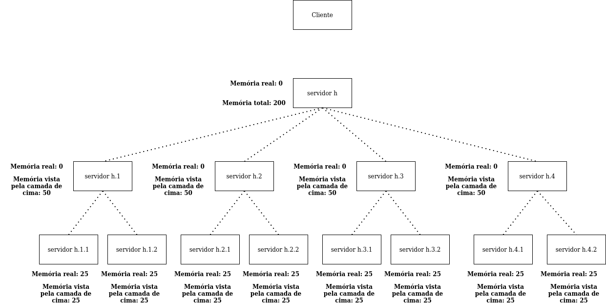

# INE5418 - Computação Distribuída: Relatório do Trabalho 1

**Alunos:** Gustavo de Castro Biage (18200424) e Matheus Eyng de França (18200435)  
**Disciplina:** Computação Distribuída  
**Semestre:** 2020.2

## Detalhamento das configurações

Ao longo do desenvolvimento da memória distribuída, teve-se como objetivo fornecer ao usuário um maior nível de liberdade relacionado à definição das configurações. Dessa forma, permite-se, por meio de argumentos passados na execução, a escolha de características como: tamanho de memória, endereços de *socket*, periodicidade de loggers, quantidade de servidores. Assim, no caso de o usuário não informar nenhum valor para uma destas características, será utilizado, algum valor padrão sensato.

| argumento         | opção padrão          | descrição             |
|-------------------|-----------------------|-----------------------|
| --server-name     | server                | Representa o nome do servidor. Utilizado na nomeação do arquivo de memória. |
| --server-ip       | 127.0.0.1 (localhost) | Endereço ip do socket deste servidor. |
| --server-port     | 8081                  | Endereço da porta do socket deste servidor. |
| --main-server     | (Não existente)       | Define que este servidor vai ser responsabilizado pela inicialização do logger. |
| --mem-size        | 10000 bytes           | Tamanho da memória deste servidor. |
| --backlog         | 256                   | Tamanho do “backlog” do servidor. Também é o tamanho do número máximo de threads inicializadas pelo servidor. |
| --register-server | (Não existente)       | Relaciona um conjunto de servidores distribuído como a sequência desta memória. O registro segue o formato **x**::**y**::**z**, onde **x** é o ip, **y** é a porta e **z** é o tamanho da memória do servidor presente no endereço. |
| --sleep-duration  | 5 minutos             | Define a periodicidade do logger, somente útil caso este seja um *main-server*. O valor é um número inteiro seguido de um caractere da unidade de tempo. (5m será 5 minutos) |

Com estes argumentos, permite-se a utilização de uma única base de código para definir um conjunto de arquiteturas de memórias distribuídas. Portanto, apresentaremos algumas das mais interessantes e um conjunto de testes para verificar a integridade das implementações. A execução dos comandos para inicialização dos servidores e execução dos testes foi realizada por regras definidas no **makefile**. O arquivo é geralmente utilizado para construção e compilação de código, porém, por familiaridade e possibilidade, testes para a aplicação também foram implementadas desta forma.

Dessarte, a execução pelo *make* será responsável pela inicialização e finalização dos processos, porém, caso haja algum erro na execução, os processos de servidores e *loggers* iniciados podem não ser finalizados. Então, deve-se tomar este cuidado, onde o usuário possivelmente precisará manualmente matar os processos criados. A existência destes processos pode ser identificada pelo comando `ps` no terminal. Caso haja algum processo de nome `server` ou `logger` rodando e que não se tenha conhecimento de sua inicialização, mate-os com o comando apresentado a seguir.

```bash
foo@bar:~/.../computacao_distribuida_trabalho_1$ killall server && killall logger
```

### Teste com uma única memória distribuída

Execução do teste:

```bash
foo@bar:~/.../computacao_distribuida_trabalho_1$ make testar
```

A memória distribuída única representa o exemplo mais simples de todos, havendo um único servidor desacoplado das aplicações que será responsável pelo controle de regiões críticas e realização das cópias de segurança de seus dados.

Neste primeiro exemplo será apresentado por completo os passos e comandos executados pela regra de teste, porém, os comandos mais triviais que envolvem remoção de arquivos e finalização de processos serão escondidos nos exemplos seguintes.

```bash
testar: build
    @rm -f server.mem # comando 1
    @./servidor --server-name server --server-port 8089 --mem-size 10000 --main-server & # comando 2
    sleep 2s # comando 3
    @./fib 127.0.0.1 8089 10 # comando 4
    @echo "finalizando servidor" # comando 5
    @killall logger # comando 6
    @killall server # comando 7
```

No comando de número um, será removido o arquivo `server.mem`, para que então, este servidor seja iniciado com uma memória nova em branco e não utilize algum arquivo previamente existente. Com exceção do teste relacionado ao *logger*, todos os testes implementados não são afetados pela reutilização de arquivos, pois, os processos clientes somente leem dados que foram escritos por eles mesmos, contudo, o objetivo é garantir que testes mais robustos funcionem corretamente sem interferência externa.

No comando de número dois, inicia-se o servidor com uma memória de tamanho 10000 bytes, neste passo, demonstra-se importante notar que o servidor é inicializado em *backgroud*, devido ao uso do caractere `&` no final da linha.

Na terceira linha, existe um *sleep* antes da inicialização do cliente, isso é necessário para que seja proporcionado tempo suficiente para que os servidores se vinculem aos seus devidos *sockets*.

Na quarta linha, inicia-se o cliente, que realizará uma série de leituras e escritas na memória, dessa vez espera-se o fim da execução do processo. Como argumentos dos clientes, informa-se o *socket* do servidor principal, cujo endereço de ip será o 127.0.0.1 e a porta será 8089, ainda, informa-se nos argumentos o comprimento do deste. O cliente calculará o valor no índice 10 da sequência de *fibonacci*.

Na quinta linha, o *makefile* colocará a mensagem “finalizando servidor” no terminal do usuário, informando ao usuário que o *servidor* e o *logger* serão finalizados. Por fim, nas duas últimas linhas, mata-se todos os processos referentes à execução dos servidores e *loggers*, concluindo o teste.

Ao longo da execução, serão impressas outras informações no terminal, assim, o cliente apresentará os valores de todos os índices calculados. A verificação da integridade das operações de leitura e escrita devem ser feitas visualmente pelo usuário, porém, são comparações simples de verificar.

### Teste com múltiplas memórias distribuídas

Execução do teste:

```bash
foo@bar:~/.../computacao_distribuida_trabalho_1$ make testar_redirecionamento
```

A memória distribuída com múltiplos servidores traz alguns dos problemas de sistemas distribuídos vistos na disciplina. Como mencionado anteriormente, foi levado em consideração uma abordagem transparente e escalável, então, decidiu-se que os clientes não devem estar cientes da existência de todos servidores que armazenam dados, mas, somente de um servidor principal que criará uma relação aos demais servidores. Deste modo, consegue-se escalar a quantidade de servidores e memórias sem que haja alguma modificação pela perspectiva do cliente. 

Como existe a necessidade de um servidor principal centralizado para fornecer acesso a todos os dados da memória, o conjunto de memórias distribuídas continua a seguir um modelo bem estruturado de cliente/servidor, onde o servidor principal atua como *proxy*.

```bash
testar_redirecionamento: build
    # ... remoção de arquivos antigos de memória
    @./server --server-name server_1 --server-port 8089 --mem-size 25 --main-server \
    --register-server "127.0.0.1::8090::25" \
    --register-server "127.0.0.1::8091::25" \
    --register-server "127.0.0.1::8092::25" & # Comando 1
    @./server --server-name server_2 --server-port 8090 --mem-size 25 & # Comando 2
    @./server --server-name server_3 --server-port 8091 --mem-size 25 & # Comando 3
    @./server --server-name server_4 --server-port 8092 --mem-size 25 & # Comando 4
    sleep 2s
    @./fib 127.0.0.1 8089 24 # Comando 5
    # ... finalização dos servidores e loggers
```

Muitos dos comandos executados se assemelham ao exemplo anterior, por isso, escondeu-se as partes mais triviais da execução, de modo que seja mantido o foco nos pontos importantes. Assim, as principais diferenças são encontradas no comando de número um, onde inicia-se um servidor em background com suas características, seguidos de três argumentos do tipo `--register-server`. Nestes três argumentos serão registrados os outros servidores da memória distribuída, informando *socket* e tamanho da memória, além disso, a ordem em que os servidores são listados representa a ordem em que as memórias dos servidores são concatenadas para formar o espaço de endereçamento único. Dessa maneira, no segundo até o quarto comando, será iniciado os processos destes três servidores registrados no servidor principal.

Como o cliente somente tem conhecimento do servidor principal, ao processar uma requisição, caso o endereço de memória se refira a outras memórias distribuídas, será retornado um ou mais redirecionamentos para os servidores corretos que devem ser consultados, junto com novos valores de índices de leitura ou escrita. Estes valores são necessários, pois, cada servidor enxerga seu endereçamento de memória como se começa-se do endereço zero. Está estratégia será melhor formalizada na seção [*Decisões de projeto*](#decisões-de-projeto).

A utilização de várias memórias resultam em alguns casos interessantes, dessa forma, os valores e tamanhos das memórias no exemplo proporcionado foram escolhidos com o objetivo de explorar estes casos. Deste modo, o cliente realizará cálculos da sequência de *fibonacci* até um índice *N*, também, os valores armazenados são todos inteiros de quatro bytes. Como são utilizados quatro memórias distribuídas de 25 bytes, os 100 bytes totais conseguem representar 25 inteiros. Por este motivo, o valor de *N* escolhido para o comprimento da execução do cliente resulta na construção dos 25 primeiros números da sequência de *fibonacci* (indexados do zero até o vinte e quatro). Assim, em cada divisão das memórias físicas, a leitura de um inteiro terá um conjunto de bytes mais significativos armazenados em uma memória, enquanto o complemento, os bytes menos significativos, estarão armazenados em outra memória.

Para os números de *fibonacci* nos índices 6, 12, 18, serão lidos/escritos seus inteiros das respectivas formas: um byte no final da primeira memória e quatro bytes no início da segunda; dois bytes no final da segunda memória e dois bytes no início da terceira; três bytes no final da terceira memória e um byte no início da quarta memória. Assim, a leitura de bytes fragmentados, sua composição e retorno correto à aplicação do cliente representa o funcionamento correto do gerenciamento no servidor principal.

### Teste com memória distribuída em hierarquias

Execução do teste:

```bash
foo@bar:~/.../computacao_distribuida_trabalho_1$ make testar_hierarquia_memoria
```

A memória hierárquica faz uso da lista de registro dos servidores e explora as características dinâmicas do servidor para construir uma hierarquia de vários níveis. Assim, a hierarquia pode ser implementar de várias formas, porém, neste exemplo somente os servidores folhas (no nível mais baixo da hierarquia) possuirão memórias e realizaram o armazenamento de dados. 

Na construção do modelo, primeiro, realiza-se a inicialização do servidor raiz, portanto, neste será registrado os servidores do segundo nível da hierarquia, contudo, o tamanho da memória escrita em cada registro não será o verdadeiro tamanho da memória iniciadas nos servidores do nível seguinte, mas sim, o tamanho total de todo o endereçamento que pode ser atingido por este ramo. Em consquência, esta mesma ideia é aplicada nos servidores dos próximos níveis, com exceção do último, que possuem servidores folha. Os Servidores folha, diferente dos outros, possuirá mesmo tamanho de memória de seu registro no nível superior. 

Abaixo apresenta-se o diagrama do modelo construído para teste. Perceba que os registros do servidor raiz enxergam os servidores da camada de nível dois como memórias de 50 bytes.



Após o cliente realizar uma requisição de leitura ou escrita para o servidor raiz, devido ao servidor raiz possuir um tamanho zero de memória, sempre será retornado ao cliente um redirecionamento para algum ramo do nível inferior. O servidor redirecionado será então, ou um servidor folha, que realiza leitura/escrita nos endereços, ou será um outro servidor de tamanho de memória zero, resultando em mais um redirecionamento. 

Neste caso, percebe-se que se o servidor raiz resolvesse ir atrás de solucionar a operação de leitura ou escrita requisitada pelo cliente, o encadeamento de redirecionamentos faria com que o próprio servidor perca muito tempo estabelecendo conexões e processando cada requisição. Possivelmente, gerando em um ponto de gargalo para o serviço operacional.

```bash
testar_hierarquia_memoria: build
   #... deletar memórias antigas
   
   # inicializar servidor raiz
   @./servidor --server-name h --server-port 8089 --mem-size 0 --main-server \
    --register-server "127.0.0.1::8090::50" \
    --register-server "127.0.0.1::8091::50" \
    --register-server "127.0.0.1::8092::50" \
    --register-server "127.0.0.1::8093::50" &

   # inicializar servidores do segundo nível
   @./servidor --server-name h.1 --server-port 8090 --mem-size 0 \
    --register-server "127.0.0.1::8094::25" \
    --register-server "127.0.0.1::8095::25" &
   @./servidor --server-name h.2 --server-port 8091 --mem-size 0 \
    --register-server "127.0.0.1::8096::25" \
    --register-server "127.0.0.1::8097::25" &
   #
   #...
   #

   # inicializar servidores folhas
   @./servidor --server-name h.1.1 --server-port 8094 --mem-size 25 &
   @./servidor --server-name h.1.2 --server-port 8095 --mem-size 25 &
   #
   #...
   #
   sleep 2s
   # Somente enxerga a raiz da hierarquia
	@./fib 127.0.0.1 8089 49
   # ... finalizar servidores e logs
```

Semelhante ao teste de múltiplas memórias, o cliente realiza o cálculo de valores de *fibonacci*, assim, a memória de 200 bytes armazena até 50 inteiro. Portanto, os casos de fragmentação dos bytes dos inteiros em diferentes memórias ocorrerão nos índices 6, 12, 18, 31, 37 e 43, enquanto nos índices 12 e 37, os bytes não estão somente em memórias diferentes, mas, estas memórias estão em ramos diferentes do servidor raiz.

Um detalhe interessante é que somente o servidor raiz precisa ser um servidor principal para que o *log* da hierarquia inteira seja construído corretamente, pois, o próprio *logger* se comporta como um cliente e realizará todos os redirecionamentos necessário para adquirir os dados e armazenar a cópia das memórias.

### Teste de funcionamento do Logger

Execução do teste:

```bash
foo@bar:~/.../computacao_distribuida_trabalho_1$ make testar_logger
```

Além dos testes de execução de clientes, que realizam escrita e leitura da memória, foi implementado um teste referente ao *logger* criado pelos servidores principais. 

Devido a decisões de implementação, o nome do arquivo de *log*, que contém a cópia das memórias, será o tempo em UTC (*Coordinated Universal Time*) do momento em que a cópia foi realizada. Portanto, se torna impossível estimar o nome do arquivo gerado, exigindo a utilização do `*` para que realize os comandos do teste em todos e, ao mesmo tempo, somente no único arquivo de *log* que estará presente no diretório.

```bash
testar_logger: build
	@rm -f resources/tmp/*.log # comando 1
	@rm -f server.mem # comando 2
	@cat resources/filled.mem > server.mem # comando 3
	@./server --server-name server --sleep-duration 10s --server-port 8089 \
     --mem-size 10000 --main-server & # comando 4
	sleep 12s # comando 5
	# ... finalização dos processos server e logs
	@cmp --silent server.mem resources/tmp/*.log && \
        echo "### SUCCESS: Files Are Identical! ###" || \
        echo "### WARNING: Files Are Different! ###" # comando 6
```

Desta maneira, o comando um deleta todos os *logs* salvos até o momento, para que no final, a execução de comandos com o `*.log` somente encontre o arquivo gerado pelo teste.

Os comandos dois e três, preencherá a memória do servidor com um conjunto de dados aleatórios, construídos previamente. Portanto, será deletado o antigo arquivo de memória existente e será copiado este conjunto de dados para a nova memória do servidor.

O quarto comando inicia o servidor com a periodicidade da construção dos *logs* igual a 10 segundos. Desta maneira, no quinto comando, dorme-se por 12 segundos, de forma que aguarde tempo suficiente para estourar o período de espera do *logger* e seja copiado a memória da aplicação para algum arquivo *.log*.

O último comando, o de número seis, realiza-se a verificação dos arquivos *.log* existente no diretório `resources/tmp/` com o conteúdo da memória do servidor, imprimindo uma mensagem conforme o resultado da comparação.

## Decisões de projeto

### Formato da memória

Tendo em vista que o principal objetivo do projeto é passar a ilusão a um usuário de que a memória do servidor é infindável, optou-se por abstrair esta memória como um arquivo permanente em disco. A principal vantagem desta abordagem é que cada servidor pode ter uma “memória” não volátil e muito maior do que o espaço de endereçamento de alocação fornecido ao processo. Outra grande vantagem desta abordagem é o fato de que o espaço de disco ser mais abundante e mais acessível em condições reais de produção, visto que há uma grande diferença de preços entre as diferentes tecnologias de memória e espaços de armazenamento físico. Contudo este modelo também apresenta desvantagens, que serão discutidas mais adiante.

### Controle de regiões críticas

Considerando o modelo de memória anteriormente explicado, foi então necessário decidir como se daria o acesso aos dados armazenados para as *threads*, mantendo o controle de concorrência exigido pela aplicação. Para o sistema ser viável, precisamos poder acessar os dados em uma determinada região tendo garantia de que eles não irão mudar até o fim do acesso, também, precisamos garantir que o acesso a uma região não bloqueie a memória inteira, permitindo leituras paralelas de diferentes partes do arquivo.

Sabendo disso, dividimos a memória em segmentos proporcionais à raiz quadrada do tamanho dessa memória. Exemplificando, se temos uma memória de tamanho *n* bytes, teremos `sqrt(n)` segmento, cada um com tamanho de `sqrt(n)` bytes. Cada um desses segmentos é protegido por controles de exclusão mútua e contém, então, um *mutex* e um semáforo usados na gerência de leitura e escrita. 

A estratégia implementada foi o de `Read Write Lock`, onde para uma região crítica da memória, pode-se ter várias *threads* lendo o conteúdo ao mesmo tempo, porém, no caso uma escrita, a *thread* escritora deve ter exclusão total para modificar o conteúdo. Por este motivo, existe um contador que indica quantos leitores estão dentro de uma determinada região.

Segue abaixo um exemplo do `lock` de acesso de um leitor.

```C
void lock_as_reader(sem_t * write_semaphore, pthread_mutex_t * mutex, int * readers) {
   // LOCK mutex
   pthread_mutex_lock(mutex);
   // increase amnt of readers
   *readers = *readers + 1;
   if (*readers == 1) {
       // LOCK write
       sem_wait(write_semaphore);
   }
   // UNLOCK mutex
   pthread_mutex_unlock(mutex);
}
```

Podemos notar que primeiro é feito o `lock` no *mutex* que gerencia o controle da quantidade de leitores na região, logo, assim que consegue-se o acesso, incrementa-se o número de leitores dentro. Se este for o primeiro leitor, então existe a necessidade de impedir a entrada de escritores, por isso, será realizado um `wait` no semáforo de escrita. Para o `unlock` do leitor, será realizado a operação reversa, assim, pela similaridade, está operação não será apresentada.

A operação de `lock` do escritor é bem mais simples, sendo feito apenas um `wait` no semáforo de escrita, enquanto no `unlock` será realizado um `post`.

```C
void lock_as_writer(sem_t* write_semaphore) {
   sem_wait(write_semaphore);
}

void unlock_as_writer(sem_t* write_semaphore) {
   sem_post(write_semaphore);
}
```

Consequentemente, quando uma *thread* no servidor quiser acessar um dado, primeiro procede-se o cálculo para saber qual região o dado se encontra, então, seja está um operação de escrita ou leitura, chama-se a respectiva função de `lock`, procedido de uma operação segura no endereço. Por questão de otimização, a *thread* não solta o `lock` da região até que todos os dados da operação que estão dentro da região sejam efetivamente operados, não havendo necessidade de liberar e adquirir, repetidamente, o acesso exclusivo da mesma região.

## Formato de mensagens

Há dois tipos de *requests* que um cliente pode fazer ao servidor depois que uma conexão for estabelecida, estas duas operações, como outras, são identificadas por constantes encontradas no **client_server.h** e são o `WRITE_MEMORY` e o `READ_MEMORY`. Estes identificadores são adicionados em um cabeçalho de mensagem, adiante, este cabeçalho é enviado para o servidor e interpretados com o uso uma `struct`, estruturando a comunicação entre o cliente e o servidor. 

```C
struct header {
       int id;
       int arg1, arg2;
};
```

O cabeçalho se compõe de um id e dois argumentos, onde os argumentos possuem significados diferentes com base no valor do id. Para um pedido de leitura e escrita do cliente, os argumentos serão, respectivamente, a posição de memória onde será iniciada a operação e o tamanho do segmento lido ou escrito.

Em relação a mensagens de resposta do servidor, existem mais possibilidades de identificadores. Devido a diversa codificação das trocas de mensagens entre as entidades, o servidor consegue pedir para que o cliente comece o envio de dados a serem escritos ou que o cliente comece a escutar pelos dados que foram lidos da memória pelo servidor.

Aqui, apresentamos um exemplo de implementação onde há o envio de mensagem para o servidor pelo lado do cliente para uma requisição de escrita na memória. Algumas partes foram omitidas para melhor visualização.

```C
void escreve(struct server* server, int posicao, char * buffer, int tam_buffer) {
   //...
   int len = sizeof(struct header);
   struct header header;
   //...
   header.id = WRITE_MEMORY;
   header.arg1 = posicao;
   header.arg2 = tam_buffer;
   write(sockfd, &header, len);
   //...
}
```

### Servidor

Entre todas as respostas que o servidor pode retornar, temos uma resposta específica para lidar com o redirecionamento para os outros servidores da memória distribuída. Assim, agora será formalizado o tratamento de requisições e redirecionamento pelo servidor, desta forma, para que fique mais compreensível, apresentaremos somente o exemplo mais interessante, o de leitura de dados pelo cliente. Contudo, a escrita ocorre de maneira bem similar.

Desta maneira, na leitura, o cliente inicialmente somente enviará o *header* da requisição e então esperará por um conjunto de instruções que o permite adquirir os dados requisitados. No servidor, existem três possibilidades de tratamento destas requisições. 
 
1. O trecho requisitado está completamente presente neste servidor.
2. O trecho requisitado está completamente fora da região de memória deste servidor.
3. Existe uma mistura entre os dois casos anteriores, onde uma parte está presente neste servidor, enquanto outra estará em um ou mais dos demais servidores.

Devido a estes diversos casos, o cliente não pode simplesmente escutar a conexão por todo o conjunto de dados que ele que ler. Pois sabe-se que nem sequer um byte poderá estar armazenado neste servidor. Então o servidor deve avisar para o cliente com uma resposta quantos bytes deverão ser enviados até ele, e somente então, o cliente poderá escutar a conexão por uma informação deste tamanho.

No primeiro caso será retornado todo o conjunto de dados requisitados pelo cliente, onde o cabeçalho da resposta avisará o cliente para escutar a conexão. Então, `response.id = READ_DATA`, `response.arg1 = request.arg2`, tal que o `request` é cabeçalho de requisição enviado pelo cliente. Apesar de parecer redundante de primeira vista avisar ao cliente que ele deve ler os dados que acabaram de ser requisitados, isto é necessário devido aos casos seguintes, em que o cliente requisita uma quantidade de dados em que pelo menos uma parte não está toda no servidor principal.

No segundo caso os dados estão todos presentes em outros servidores, então, o servidor enviará um redirecionamento para o cliente. Portanto, `response.id = REDIRECT`, não havendo necessidades de argumentos. Neste caso, o cabeçalho de resposta será seguido de uma `struct` de redirecionamento.

No terceiro caso, a solução encontra-se genérica o suficiente para respeitar os dois casos anteriores, por isso, este foi o único implementado na aplicação. Assim, o servidor retorna os dados disponíveis em sua memória e também calcula os novos índices que o cliente deve requisitar aos outros servidores que contêm o resto dos dados. Com isso alcançamos uma transparência quanto à localização de dados. 

A estrutura de redirecionamento que é enviada ao cliente se compõe de outras estruturas que armazenam: as informações do servidor; os índices e comprimentos da operação, atualizados conforme o servidor redirecionado e seu espaço de endereçamento.

```C
// definidos em client_server.h
struct server {
    char ip[16];
    int port;
};

struct redirect {
    struct mem_range range;
    struct server server;
}

// definido em memory_utils.h
struct mem_range {
    int start, length;
}
```

Outro ponto interessante está relacionado ao uso do redirecionamento, a ideia é que o servidor não deva se encarregar de ir buscar o dado para o cliente, gerando um maior custo necessário para suprir uma requisição. Ao contrário, o servidor irá retornar o conjunto de dados relacionados à nova requisição para o cliente realizar, ao mesmo tempo, se desapegando dessa responsabilidade e aliviando o estresse encarregado sobre os servidores principais. Esta ideia foi estudada na disciplina de Redes de Computadores II em relação ao servidor de DNS local e os demais servidores DNS.

## Limitações

Por conta de algumas decisões de projeto, certas limitações ficam aparentes. A primeira delas é o fato de a memória ser um **arquivo presente em disco rígido**. Sabemos que os acessos ao disco são ordens de magnitude mais lentos que acessos a memórias do tipo SRAM ou DRAM. Devido a isso, nosso sistema provavelmente não estaria apto para um sistema de produção real, onde poderia haver muitas requisições por segundo, fazendo com que pedidos regulares de acesso a memória custem caro. Então, servidores muito requisitados podem facilmente se tornarem pontos de gargalo do serviço.

Uma possível solução para este problema seria usar de algoritmos de cache como LRU ou MRU, implementados em *software*. Deste modo, blocos de memória seriam armazenados no espaço de endereçamento do processo, ao invés de precisar acessar o disco ou ajustar o *offset* de referência do arquivo toda vez que um dado seja consultado.

Outro problema são os **múltiplos redirecionamentos** enviados ao cliente na requisição de uma operação. No caso da leitura de dados, a implementação da cache também reduziria esse custo de finalizar e estabelecer novas conexões com outros servidores, uma vez que os servidores podem identificar e enviar trechos muitos requisitados ao servidor principal e estes trechos poderiam ser retornados diretamente ao cliente, sem a necessidade de serem buscados em outro lugar. Múltiplos redirecionamentos são prejudiciais ao desempenho do sistema pois resultam em um longo tempo de resposta ao cliente, com a possibilidade de tornar a aplicação inutilizável.

Apesar de todas as limitações mencionadas, talvez a mais crítica seja a presença de diversos **pontos únicos de falha**. Como um segmento de memória somente é representado por um servidor, sem replicação das memórias, no caso de este servidor falhar, o segmento inteiro se torna inacessível aos clientes. Como o servidor principal realiza o armazenamento de cópias periódicas das memórias, um novo servidor que se dispõem de ocupar o lugar deste segmento falho de memória, poderia ser registrado no servidor principal e inicializado com o conteúdo salvo na memória do *log* mais recente. Outra solução seria simplesmente a inicialização de vários servidores cadastrados que mapeiam para o mesmo segmento de memória, por consequência, remove-se o ponto único de falha e possibilita distribuir a carga entre os servidores, porém, requer um maior nível de coordenação relacionado a escrita de dados.

A primeira proposta, onde os servidores se dispõem de assumir uma responsabilidade na rede, torna a arquitetura semelhante a uma rede *peer-to-peer*, enquanto na segunda proposta seria mantido a arquitetura cliente/servidor.

Outra característica que contribui para a impossibilidade de operação em um sistema de produção real é a segurança do sistema. Uma vez que não existe algum tipo de autenticação dos clientes que requisitam operações, o sistema se encontra vulnerável a ataques de negação de serviço por entidade maliciosa. Além disso, como não existe nenhum nível de permissão individual dos clientes sobre os endereços de memória, qualquer processo com intenção maléfica poderá facilmente deletar ou corromper os dados armazenados. Uma solução para o problema seria a implementação de autenticação dos clientes, contudo, adiciona-se um custo computacional no início de cada conexão e necessita que os dados sejam trocados de uma forma segura, uma vez que chaves de autenticação são informações sensíveis.